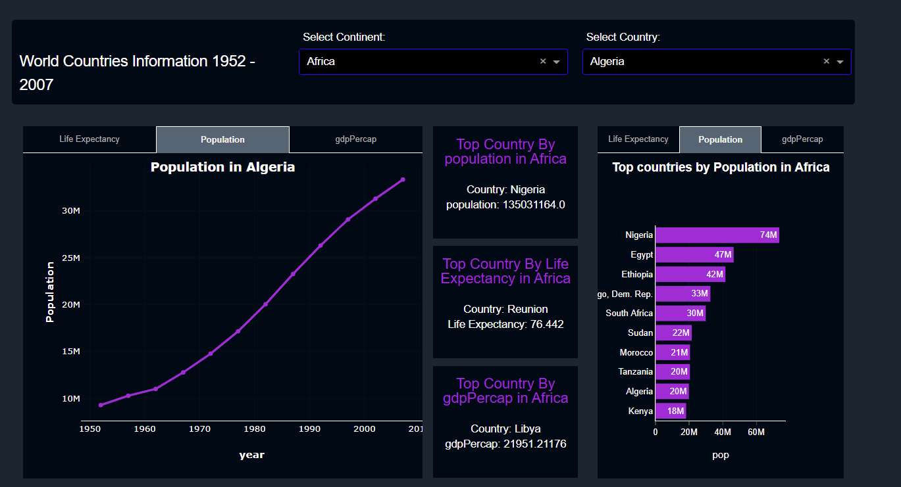

<h1>Table of Contents<span class="tocSkip"></span></h1>
<div class="toc"><ul class="toc-item"><li><span><a href="#Final-dash-board" data-toc-modified-id="Final-dash-board-1"><span class="toc-item-num">1&nbsp;&nbsp;</span>Final dash board</a></span></li><li><span><a href="#imports" data-toc-modified-id="imports-2"><span class="toc-item-num">2&nbsp;&nbsp;</span>imports</a></span></li><li><span><a href="#Read-Data" data-toc-modified-id="Read-Data-3"><span class="toc-item-num">3&nbsp;&nbsp;</span>Read Data</a></span></li><li><span><a href="#Styles(CSS)" data-toc-modified-id="Styles(CSS)-4"><span class="toc-item-num">4&nbsp;&nbsp;</span>Styles(CSS)</a></span></li><li><span><a href="#Dash-layout" data-toc-modified-id="Dash-layout-5"><span class="toc-item-num">5&nbsp;&nbsp;</span>Dash layout</a></span><ul class="toc-item"><li><span><a href="#Function-used-in-callbacks" data-toc-modified-id="Function-used-in-callbacks-5.1"><span class="toc-item-num">5.1&nbsp;&nbsp;</span>Function used in callbacks</a></span></li></ul></li><li><span><a href="#callbacks" data-toc-modified-id="callbacks-6"><span class="toc-item-num">6&nbsp;&nbsp;</span>callbacks</a></span><ul class="toc-item"><li><span><a href="#Line-Charts-callbacks" data-toc-modified-id="Line-Charts-callbacks-6.1"><span class="toc-item-num">6.1&nbsp;&nbsp;</span>Line Charts callbacks</a></span><ul class="toc-item"><li><span><a href="#Life-Expectancy-Update" data-toc-modified-id="Life-Expectancy-Update-6.1.1"><span class="toc-item-num">6.1.1&nbsp;&nbsp;</span>Life Expectancy Update</a></span></li><li><span><a href="#Population-Update" data-toc-modified-id="Population-Update-6.1.2"><span class="toc-item-num">6.1.2&nbsp;&nbsp;</span>Population Update</a></span></li><li><span><a href="#gdpPercap-Update" data-toc-modified-id="gdpPercap-Update-6.1.3"><span class="toc-item-num">6.1.3&nbsp;&nbsp;</span>gdpPercap Update</a></span></li></ul></li><li><span><a href="#Text-callbacks" data-toc-modified-id="Text-callbacks-6.2"><span class="toc-item-num">6.2&nbsp;&nbsp;</span>Text callbacks</a></span></li><li><span><a href="#Bar-Charts-Callbacks" data-toc-modified-id="Bar-Charts-Callbacks-6.3"><span class="toc-item-num">6.3&nbsp;&nbsp;</span>Bar Charts Callbacks</a></span><ul class="toc-item"><li><span><a href="#Life-Expectancy-Update" data-toc-modified-id="Life-Expectancy-Update-6.3.1"><span class="toc-item-num">6.3.1&nbsp;&nbsp;</span>Life Expectancy Update</a></span></li><li><span><a href="#Population-Update" data-toc-modified-id="Population-Update-6.3.2"><span class="toc-item-num">6.3.2&nbsp;&nbsp;</span>Population Update</a></span></li><li><span><a href="#gdpPercap-Update" data-toc-modified-id="gdpPercap-Update-6.3.3"><span class="toc-item-num">6.3.3&nbsp;&nbsp;</span>gdpPercap Update</a></span></li></ul></li></ul></li><li><span><a href="#Running-the-server" data-toc-modified-id="Running-the-server-7"><span class="toc-item-num">7&nbsp;&nbsp;</span>Running the server</a></span></li></ul></div>

# Final dash board 


# imports


```python
# imports 
import dash
import dash_core_components as dcc
import dash_html_components as html
from dash.dependencies import Input, Output
import plotly.graph_objs as go
import pandas as pd
import pathlib
```

# Read Data


```python
data = pd.read_csv('data/gapminderDataFiveYear.csv')
year_list = list(data['year'].unique())
```


```python
#creating dash borad (Launch the application:)
app = dash.Dash()
```

# Styles(CSS)


```python
tabs_styles = {"flex-direction": "row",}
tab_style = {"padding": "1.3vh","color": '#AEAEAE',"fontSize": '.9vw',"backgroundColor": '#010914',
             'border-bottom': '1px white solid'}
tab_selected_style = {"fontSize": '.9vw', "color": '#F4F4F4',"padding": "1.3vh",'fontWeight': 'bold',
                      "backgroundColor": '#566573','border-top': '1px white solid','border-left': '1px white solid',
                      'border-right': '1px white solid', 'border-radius': '0px 0px 0px 0px',}

```


```python
life_expectancy = dcc.Graph(id = 'line_chart1',config = {'displayModeBar': False}, className = 'line_chart_width')
population = dcc.Graph(id = 'line_chart2',config = {'displayModeBar': False}, className = 'line_chart_width')
gdp_per_cap = dcc.Graph(id = 'line_chart3',config = {'displayModeBar': False}, className = 'line_chart_width')
life_expectancy_bar = dcc.Graph(id = 'bar_chart1',config = {'displayModeBar': False}, className = 'bar_chart_height')
population_bar = dcc.Graph(id = 'bar_chart2', config = {'displayModeBar': False}, className = 'bar_chart_height')
gdp_per_cap_bar = dcc.Graph(id = 'bar_chart3',config = {'displayModeBar': False}, className = 'bar_chart_height')
```

#  Dash layout


```python
# Creating  a Dash layout that contains a Graph component:
app.layout = html.Div([
    html.Div([
        html.Div([
            #-------------------------------------------------------------------
            # div row names Above drop  down
            html.Div([
                html.P('', className = 'fix_label', style = {'color': 'white'}),
                html.P('Select Continent:', className = 'fix_label', style = {'color': 'white'}),
                html.P('Select Country:', className = 'fix_label', style = {'color': 'white'}),
                        ], className = 'adjust_title'),
            #-------------------------------------------------------------------
            #div row of drop down
            html.Div([
                html.H5('World Countries Information 1952 - 2007', className = 'title_text'),
                dcc.Dropdown(id = 'select_continent',value ='Africa',placeholder = 'Select Continent',
                             options = [{'label': c, 'value': c}for c in data['continent'].unique()],
                             style = {'display': True,'border-color': 'blue'},
                             className = 'dcc_compon'),
                dcc.Dropdown(id = 'select_countries',placeholder = 'Select Country',
                             style = {'display': True,'border-color': 'blue'},
                             options = [],className = 'dcc_compon'),
                        ], className = 'adjust_drop_down_lists'),
            #-------------------------------------------------------------------
        ], className = "title_container twelve columns")
    ], className = "row flex-display"),
  # Manually select metrics
    html.Div([
        html.Div([
             #-------------------------------------------------------------------
            #Taps for line charts
            dcc.Tabs(id = "tabs-styled-with-inline", value = 'population', children = [
                dcc.Tab(life_expectancy,label = 'Life Expectancy',value = 'life_expectancy',
                        style = tab_style,selected_style = tab_selected_style,className = 'font_size'),
                dcc.Tab(population,label = 'Population',value = 'population',
                        style = tab_style, selected_style = tab_selected_style, className = 'font_size'),
                dcc.Tab(gdp_per_cap,label = 'gdpPercap',value = 'gdp_per_cap',style = tab_style,
                        selected_style = tab_selected_style,className = 'font_size'),
            ], style = tabs_styles,colors = {"border": None, "primary": None,"background": None},
                     className = 'tabs_width'),
                    ], className = 'create_container six columns'),
         #-------------------------------------------------------------------
        html.Div([
            html.Div([
                html.Div([ 
                            html.Div(id='text1', className = 'grid_height'),
                            html.Div(id = 'text2', className = 'grid_height'),
                            html.Div(id = 'text3', className = 'grid_height'),
                        ], className = 'grid_one_column'),
                 #-------------------------------------------------------------------
                #Taps for bar charts
                dcc.Tabs(id = "tabs-styled-with-inline1", value = 'population', 
                         children = [
                                        dcc.Tab(life_expectancy_bar,label = 'Life Expectancy',value = 'life_expectancy',
                                                style = tab_style,selected_style = tab_selected_style,
                                                className = 'font_size'),
                                        dcc.Tab(population_bar,label = 'Population',value = 'population',
                                                style = tab_style,selected_style = tab_selected_style,
                                                className = 'font_size'),
                                        dcc.Tab(gdp_per_cap_bar,label = 'gdpPercap',value = 'gdp_per_cap',
                                                style = tab_style,selected_style = tab_selected_style,
                                                className = 'font_size'),
                                    ], style = tabs_styles,colors = {"border": None,"primary": None,"background": None}),
                        ], className = 'adjust_grids')
                    ], className = 'create_container six columns')
        ], className = "row flex-display"),
], id= "mainContainer", style={"display": "flex", "flex-direction": "column"})

```

## Function used in callbacks


```python
def Scatter(data,select_countries,x,y,title):
    return {'data':[go.Scatter(x = data[x],y = data[y],text = data[y],
                line = {"width" : 3,"color" : '#9A38D5'},
                hoverinfo = 'text',
                hovertext =
                '<b>Country</b>: ' + data['country'].astype(str) + '<br>' +
                '<b>Year</b>: ' + data[x].astype(str) + '<br>' +
                '<b>Continent</b>: ' + data['continent'].astype(str) + '<br>' +
                f'<b>{title}</b>: ' + [f'{x:,.3f}' for x in data[y]] + '<br>')],

        'layout': go.Layout(plot_bgcolor='#010914',paper_bgcolor='#010914',
             title={'text': f'<b>{title}'+' '+ 'in'+' '+str(select_countries),'y': 0.97,'x': 0.5},
            # hovermode='closest',
             margin = dict(t = 15, r = 0),
             xaxis = dict(title = f'<b>{x}</b>', linecolor = 'white',),
             yaxis = dict(title = f'<b>{title}</b>'),
             font = {"color" : 'white'},)}


def bar(data,select_continent,x,y,title):
    return {'data':[go.Bar(x = data[x],y = data[y],text = data[x],texttemplate = '%{text:.2s}',textposition = 'auto',
                orientation = 'h',marker = {"color" :'#9A38D5'},hoverinfo = 'text',
                hovertext=data[x].round(2).astype(str) )],

        'layout': go.Layout(plot_bgcolor='#010914',paper_bgcolor='#010914',
             title={'text': f'<b>Top countries by {title} in {select_continent}','y': 0.97,'x': 0.5},
             xaxis = {"title":x ,"showticklabels":True, "linecolor":'white','linewidth':1,'ticks':'outside'},
             yaxis = {"title":"","autorange":'reversed',"linecolor":'white'},
             font = {"family" : "sans-serif","size" : 12,"color" : 'white'} )}
```

# callbacks


```python
@app.callback(Output('select_countries', 'options'),Input('select_continent', 'value'))
def get_country_options(select_continent):
    data1 = data[data['continent'] == select_continent]
    return [{'label': i, 'value': i} for i in data1['country'].unique()]
#callback for getting country_value
@app.callback(Output('select_countries', 'value'),Input('select_countries', 'options'))
def get_country_value(select_countries):
    return [k['value'] for k in select_countries][0]
```

## Line Charts callbacks

### Life Expectancy Update


```python
#callback for Update graph Life Expectancy
@app.callback(Output('line_chart1', 'figure'),[Input('select_continent', 'value')],[Input('select_countries', 'value')])
def update_graph(select_continent, select_countries):
    data1 = data.groupby(['country', 'year', 'continent'])[['pop', 'lifeExp', 'gdpPercap']].sum().reset_index()
    data1 = data1[(data1['continent'] == select_continent) & (data1['country'] == select_countries)]
    return Scatter(data1,select_countries,'year','lifeExp' ,'Life Expectancy')
```

###  Population Update


```python
#callback for Update graphs Population
@app.callback(Output('line_chart2', 'figure'),[Input('select_continent', 'value')],[Input('select_countries', 'value')])
def update_graph(select_continent, select_countries):
    data1 = data.groupby(['country', 'year', 'continent'])[['pop', 'lifeExp', 'gdpPercap']].sum().reset_index()
    data1 = data1[(data1['continent'] == select_continent) & (data1['country'] == select_countries)]
    return Scatter(data1,select_countries,'year','pop' ,'Population')
```

### gdpPercap Update


```python
#callback for Update graphs gdpPercap
@app.callback(Output('line_chart3', 'figure'),[Input('select_continent', 'value')],[Input('select_countries', 'value')])
def update_graph(select_continent, select_countries):
    data1 = data.groupby(['country', 'year', 'continent'])[['pop', 'lifeExp', 'gdpPercap']].sum().reset_index()
    data1 = data1[(data1['continent'] == select_continent) & (data1['country'] == select_countries)]
    return  Scatter(data1,select_countries,'year','gdpPercap' ,'gdpPercap')
```

## Text callbacks


```python
#text_d(data,'pop','population')
def text_d(data,var,title):
    data_continent = data['continent'].iloc[0]
    top_country = data['country'].iloc[0]
    top = data[var].iloc[0]
    return [html.H6(f'Top Country By {title} in {data_continent}',
                       style = {'textAlign': 'center','line-height': '1','color': '#9A38D5','margin-top': '15px'}
                       ),
               html.P(f'Country: {top_country}',
                      style = {'textAlign': 'center','color': 'white ','fontSize': 15,'margin-top': '20px'}
                      ),
               html.P(f'{title}: {top}',
                      style = {'textAlign': 'center','color': 'white ','fontSize': 15,'margin-top': '-10px'
                               }
                     )]

```


```python
#callback for Updating population
@app.callback(Output('text1', 'children'),[Input('select_continent', 'value')])
def update_text(select_continent):
    data1 = data.groupby(['country', 'year', 'continent'])[['pop', 'lifeExp', 'gdpPercap']].sum().reset_index()
    data1 = data1[(data1['continent'] == select_continent)].nlargest(1, columns = ['pop'])
    return text_d(data1,'pop','population')

#callback for Update life Expectancy
@app.callback(Output('text2', 'children'), [Input('select_continent', 'value')])
def update_text(select_continent):
    data1 = data.groupby(['country', 'year', 'continent'])[['pop', 'lifeExp', 'gdpPercap']].sum().reset_index()
    data1 = data1[(data1['continent'] == select_continent)].nlargest(1, columns = ['lifeExp'])
    return text_d(data1,'lifeExp','Life Expectancy')

#callback for Update gdpPercap
@app.callback(Output('text3', 'children'),[Input('select_continent', 'value')])
def update_text(select_continent):
    data1 = data.groupby(['country', 'year', 'continent'])[['pop', 'lifeExp', 'gdpPercap']].sum().reset_index()
    data1 = data1[(data1['continent'] == select_continent)].nlargest(1, columns = ['gdpPercap'])
    return text_d(data1,'gdpPercap','gdpPercap')  
```

##  Bar Charts Callbacks 

###  Life Expectancy Update


```python
@app.callback(Output('bar_chart1', 'figure'),[Input('select_continent', 'value')])
def update_graph(select_continent):
    data1 = data.groupby(['country', 'continent'])[['pop', 'lifeExp', 'gdpPercap']].mean().reset_index()
    data1 = data1[(data1['continent'] == select_continent)].nlargest(10, columns = ['lifeExp'])
    return bar(data1,select_continent,'lifeExp','country','Life Expectancy')
```

### Population Update


```python
@app.callback(Output('bar_chart2', 'figure'),[Input('select_continent', 'value')])
def update_graph(select_continent):
    data1 = data.groupby(['country', 'continent'])[['pop', 'lifeExp', 'gdpPercap']].mean().reset_index()
    data1 = data1[(data1['continent'] == select_continent)].nlargest(10, columns = ['pop'])
    return bar(data1,select_continent,'pop','country','Population')
```

### gdpPercap Update


```python
@app.callback(Output('bar_chart3', 'figure'),[Input('select_continent', 'value')])
def update_graph(select_continent):
    data1 = data.groupby(['country', 'continent'])[['pop', 'lifeExp', 'gdpPercap']].mean().reset_index()
    data1 = data1[(data1['continent'] == select_continent)].nlargest(10, columns = ['gdpPercap'])
    return bar(data1,select_continent,'gdpPercap','country','gdpPercap')
```

#  Running the server


```python
app.run_server()
```

    Dash is running on http://127.0.0.1:8050/
    
     * Serving Flask app "__main__" (lazy loading)
     * Environment: production
       WARNING: This is a development server. Do not use it in a production deployment.
       Use a production WSGI server instead.
     * Debug mode: off
    

     * Running on http://127.0.0.1:8050/ (Press CTRL+C to quit)
    127.0.0.1 - - [06/Nov/2021 04:42:59] "GET / HTTP/1.1" 200 -
    127.0.0.1 - - [06/Nov/2021 04:42:59] "GET /_dash-layout HTTP/1.1" 200 -
    127.0.0.1 - - [06/Nov/2021 04:42:59] "GET /_dash-dependencies HTTP/1.1" 200 -
    127.0.0.1 - - [06/Nov/2021 04:42:59] "GET /_favicon.ico?v=2.0.0 HTTP/1.1" 200 -
    127.0.0.1 - - [06/Nov/2021 04:43:00] "GET /_dash-component-suites/dash/dcc/async-dropdown.js HTTP/1.1" 200 -
    127.0.0.1 - - [06/Nov/2021 04:43:00] "GET /_dash-component-suites/dash/dcc/async-graph.js HTTP/1.1" 200 -
    127.0.0.1 - - [06/Nov/2021 04:43:00] "POST /_dash-update-component HTTP/1.1" 200 -
    127.0.0.1 - - [06/Nov/2021 04:43:00] "POST /_dash-update-component HTTP/1.1" 200 -
    127.0.0.1 - - [06/Nov/2021 04:43:00] "POST /_dash-update-component HTTP/1.1" 200 -
    127.0.0.1 - - [06/Nov/2021 04:43:00] "POST /_dash-update-component HTTP/1.1" 200 -
    127.0.0.1 - - [06/Nov/2021 04:43:00] "POST /_dash-update-component HTTP/1.1" 200 -
    127.0.0.1 - - [06/Nov/2021 04:43:00] "POST /_dash-update-component HTTP/1.1" 200 -
    127.0.0.1 - - [06/Nov/2021 04:43:00] "POST /_dash-update-component HTTP/1.1" 200 -
    127.0.0.1 - - [06/Nov/2021 04:43:00] "POST /_dash-update-component HTTP/1.1" 200 -
    127.0.0.1 - - [06/Nov/2021 04:43:00] "POST /_dash-update-component HTTP/1.1" 200 -
    127.0.0.1 - - [06/Nov/2021 04:43:00] "POST /_dash-update-component HTTP/1.1" 200 -
    127.0.0.1 - - [06/Nov/2021 04:43:00] "POST /_dash-update-component HTTP/1.1" 200 -
    
